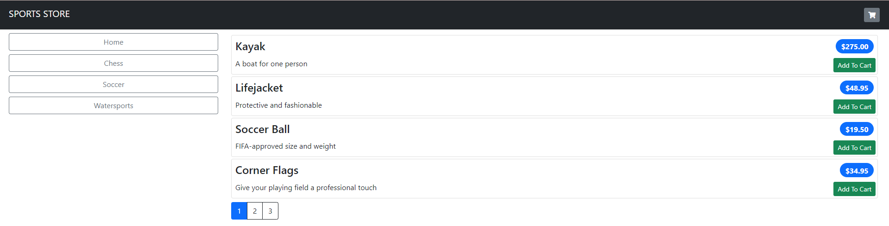

# SportsShop
Copy of any online store at minimal
# For start project use console with next command:
### `dotnet run`
# After running app you seen next:

# On Index page I use filter by categories, and you of course can add something in the cart. If you chose all needed products click on cart icon(top-left corner):

# Input information for order(validation appended):

# After click on `Complete Order`, you see next page

